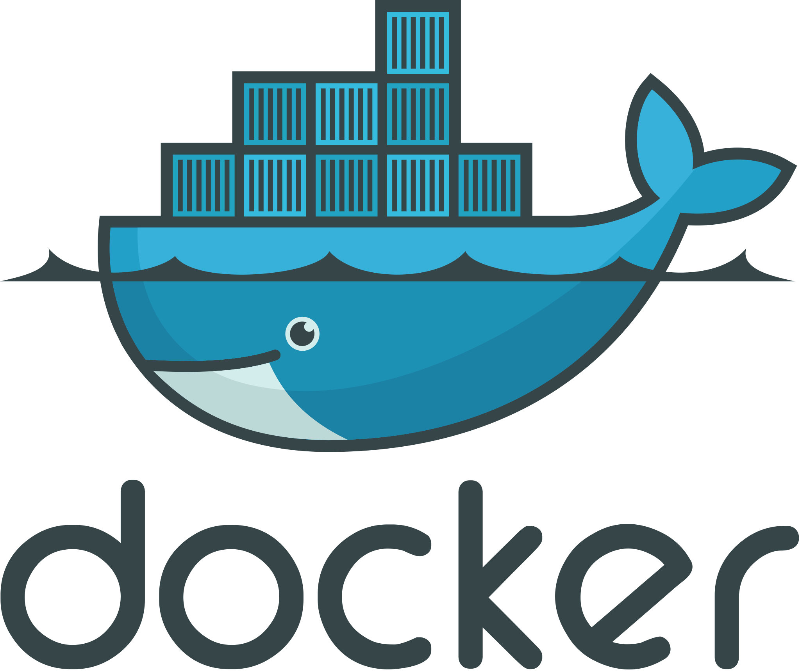

<h3 align="center"><samp>Hello! I am <b><a rel="nofollow noopener noreferrer" target="_blank" href="https://cyber-eternal.github.io/">Edgar Sargsyan</a></b></samp></h3>

 
  <samp>
    「 Back End Software Engineer || Cloud Solution Architect 」 
  </samp>

   
 <samp>&#9776; Details</samp>

   

 

I'm Back End Software Engineer and Cloud Solution Architect. My aim is not only to establish coding but also to provide relevant and clear-cut coding methods that are implemented in order to attain the most efficient coding system possible, writing of the high-performance code, increasing code coverage by unit and integration tests, saving time and resources for wasting, acceleration of releases, hardworking, team management, decision making, and problem-solving, strong communication and collaboration, I'm able to motivate and lead others in a team environment, to work in a team, and in stressful situations.

 

Feel free to contact me and have a nice day!

  

 

 

</img> 
Check out my <a rel="nofollow noopener noreferrer" target="_blank" href="https://cyber-eternal.github.io/src/Kevin_Cui_Resume.pdf">Resume</a>  
</samp>

  

 
 

<languages align="center">

 
════════ 
 <samp>Languages and Technologies</samp>

 

 

 

<!--  -->
 
 
</languages>

<samp>
  

    ════════ 
    From <a href="https://github.com/cyber-eternal/cyber-eternal">Cyber Eternal</a>
  

</samp>
